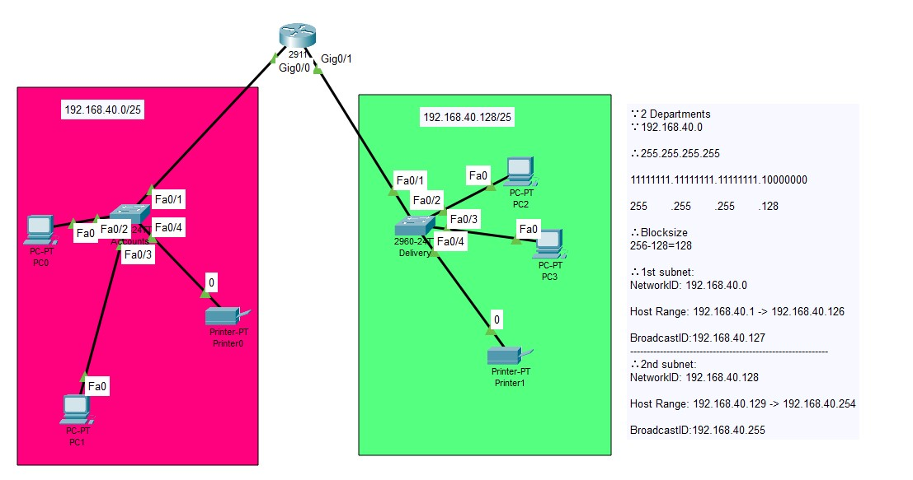

### 📝 Problem Recap

You need to design a network to connect **Accounts** and **Delivery** departments with the following conditions:

1. Each department must have at least 2 PCs.
    
2. Use appropriate switches/routers.
    
3. Use **192.168.40.0/24** network with correct IPs, subnet mask, and gateways.
    
4. All devices must be connected with correct cables.
    
5. Delivery PCs should be able to ping Accounts PCs (i.e., network connectivity must be successful).
    

---
## Topology Preview
    
---

## Step-by-Step Solution

### **Step 1: Plan the Network**

- **Departments:**
    
    - Accounts: 2 PCs minimum
        
    - Delivery: 2 PCs minimum
        
- **Devices Needed:**
    
    - 1 Router (to connect both departments)
        
    - 2 Switches (1 per department)
        
    - 4 PCs (2 for Accounts, 2 for Delivery)
        
- **Cables:** Straight-through for PC ↔ Switch, and Switch ↔ Router
    

---

### **Step 2: Subnet the Network**

Given: `192.168.40.0/24`

- Subnet Mask: `255.255.255.0`
    
- Assign subnets:
    
    - Accounts: `192.168.40.0 – 192.168.40.127`
        
    - Delivery: `192.168.40.128 – 192.168.40.255`
        

Example:

- **Accounts PCs:**
    
    - PC1: `192.168.40.2`, Mask `255.255.255.0`, Gateway `192.168.40.1`
        
    - PC2: `192.168.40.3`, Mask `255.255.255.0`, Gateway `192.168.40.1`
		
	- Printer: `192.168.40.4`, Mask `255.255.255.0`, Gateway `192.168.40.1`
	
- **Delivery PCs:**
    
    - PC1: `192.168.40.130`, Mask `255.255.255.128`, Gateway `192.168.40.129`
        
    - PC2: `192.168.40.131`, Mask `255.255.255.128`, Gateway `192.168.40.129`
        
	- Printer: `192.168.40.132`, Mask `255.255.255.128`, Gateway `192.168.40.129`

---

### **Step 3: Connect the Devices**

- Connect **Accounts PCs → Accounts Switch**
    
- Connect **Delivery PCs → Delivery Switch**
    
- Connect **Accounts Switch → Router (gig0/0)**
    
- Connect **Delivery Switch → Router (gig0/1)**
    

---

### **Step 4: Configure the Router Interfaces**

On Router:

- **gig0/0 (Accounts side):**
    
    - IP: `192.168.40.1`
        
    - Mask: `255.255.255.128`

		`conf t
		`int gig0/0
		`ip address 192.168.40.1 255.255.255.128
		`do write`
- **gig0/1 (Delivery side):**
    
    - IP: `192.168.40.129`
        
    - Mask: `255.255.255.128`
        
		`conf t
		`int gig0/1
		`ip address 192.168.40.129 255.255.255.128
		`do write`
---

### **Step 5: Configure IP on PCs**

- Go to each PC → Desktop → IP Configuration.
    
- Assign IPs, subnet mask, and default gateway as planned in Step 2.
    

---

### **Step 6: Test Connectivity**

- From a Delivery PC → Ping Accounts PC.  
    Example: `ping 192.168.40.10`
	 ∵ successful 
	 ∴connectivity is working.
    

---

### ✅ Final Outcome

- Accounts and Delivery PCs are in separate subnets.
    
- Router connects the two networks.
    
- PCs in **Delivery** department can ping PCs in **Accounts** department.